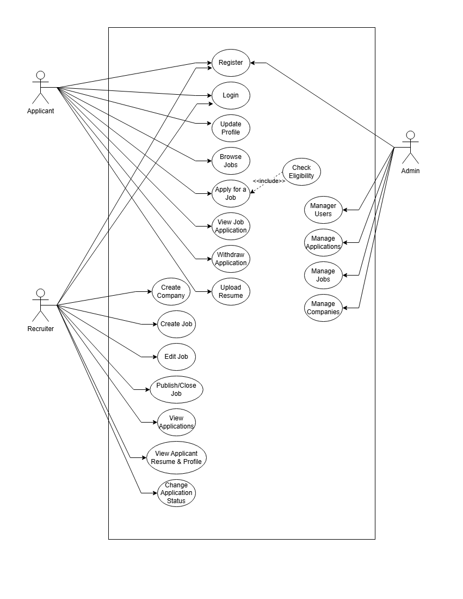
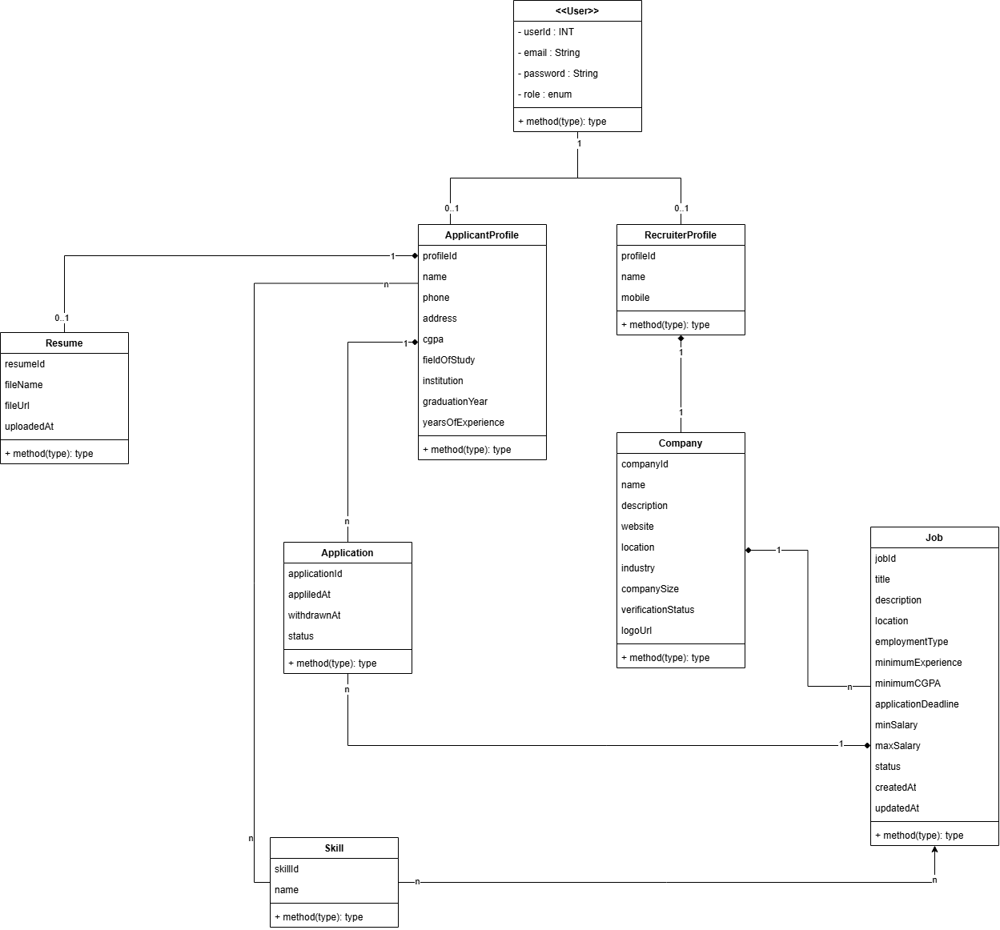
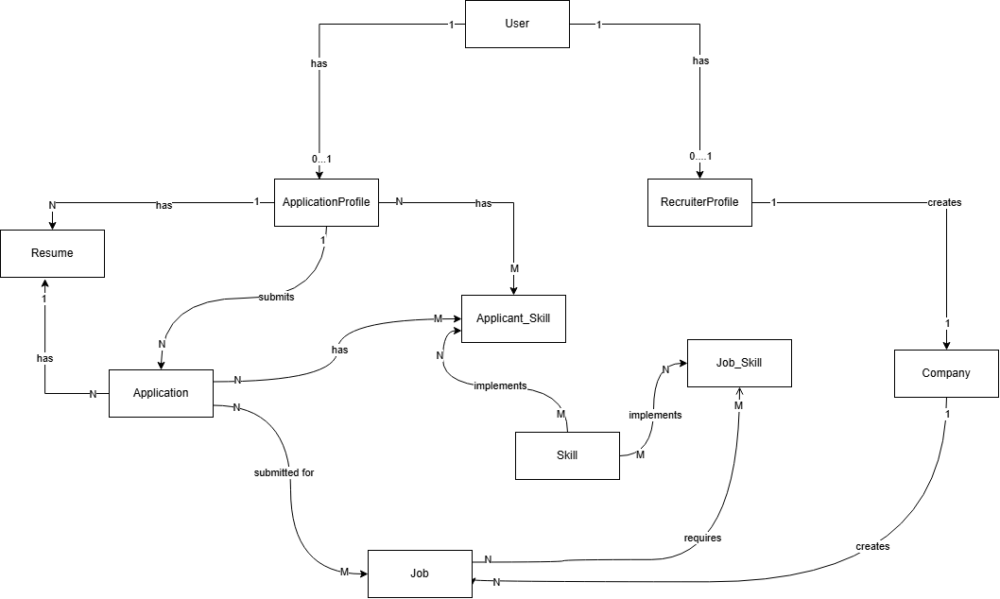
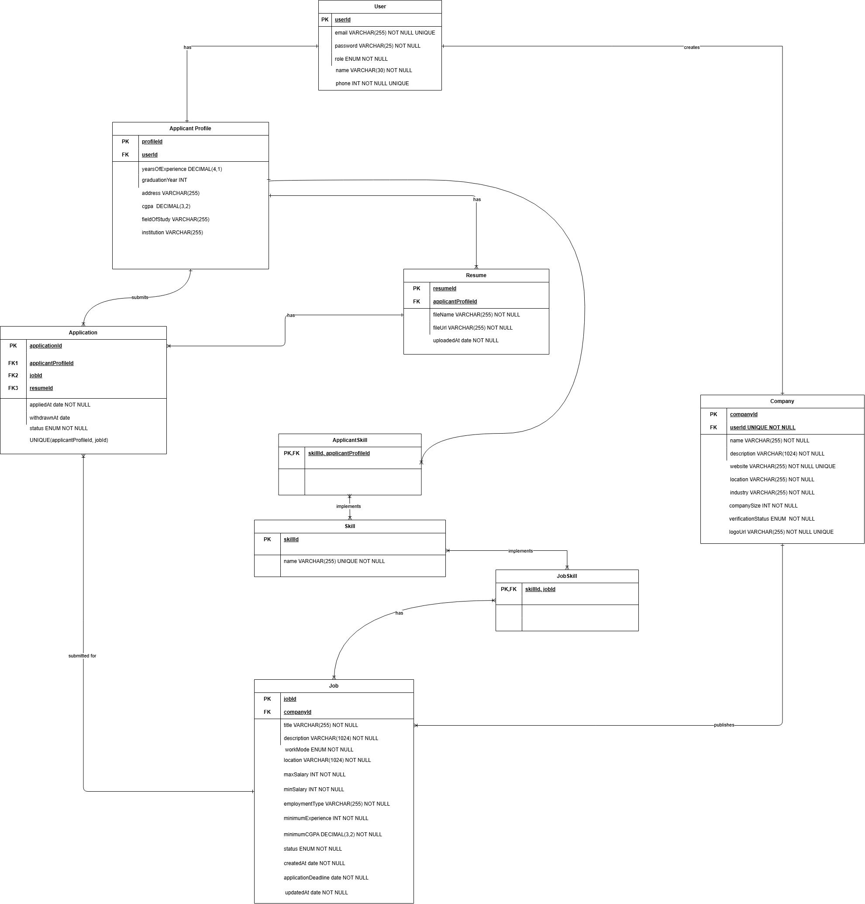

Hello!!
HireHub is my first Major Project so I hope it goes well.

HireHub is a hiring platform where recruiters post job openings and applicants can apply for the jobs they like.

We'll be rolling out features in this application in three phases:

### Phase 1 — Core HireHub

**Authentication & authorization**

- Register
- Login
- JWT
- Roles
- Refresh tokens
- Role-based authorization

**Applicant**

- Profile
- Education
- Skills
- Resume
- Browse jobs
- Apply
- View applications
- Withdraw application

**Recruiter**

- Create company
- Create job
- Edit job
- Publish/close job
- View applications
- View applicant profile/resume
- Change application status

**Admin**

- Manage users
- Manage companies
- Manage jobs
- Manage applications

That's already a substantial project.

### Phase 2 — Make it impressive

Add:

- Recruiter analytics
- Applicant job recommendations
- Company verification
- Job search/filtering
- Pagination
- Sorting
- Application deadline
- Job expiration
- Better applicant filtering

### Phase 3 — Advanced features

- Resume parsing
- Skill extraction
- Recommendation scoring
- Email notifications
- Interview scheduling
- Application status notifications
- Saved jobs
- Job alerts
- Full-text search
- Redis caching
- Elasticsearch/OpenSearch
- S3 resume storage
- Async processing

#### Let's now start with Phase 1:

We're first going to identify use cases for our actors using a **USE CASE DIAGRAM**

Actors: Admin, Recruiter, Applicant.

We now identify classes and relationships between them

We now identify Entities and relationships amongst them then we'll start implementation part

This is our Entity Flow 

Now we created the final er for phase 1 and understood that right now we don't need a separate recruiter profile, based on user credentials a user if it's a recruiter can create company and do subsequent tasks.

Attributes name and mobile are also moved to user as they're also found essential.

